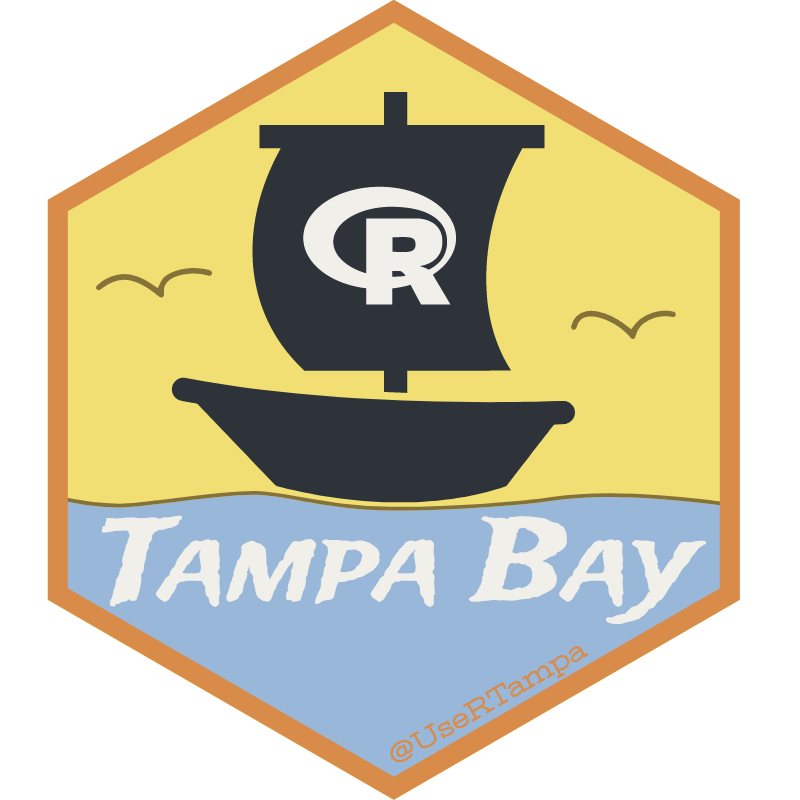

# TampaUseRs

[meetup]: https://www.meetup.com/Tampa-R-Users-Group/
[twitter]: https://www.twitter.com/UseRTampa/

a repository for slides, code, and other materials for the Tampa R Users Group

## TampaUseRs Links

- [Meetup][meetup]

- [&commat;UseRTampa on Twitter][twitter]

---

 

Please note that we follow the [Contributor Code of Conduct](CODE_OF_CONDUCT.md) and the [R Consortium Community Code of Conduct](https://wiki.r-consortium.org/view/R_Consortium_and_the_R_Community_Code_of_Conduct).
By participating in the Tampa R Users Group you agree to abide by their terms.
