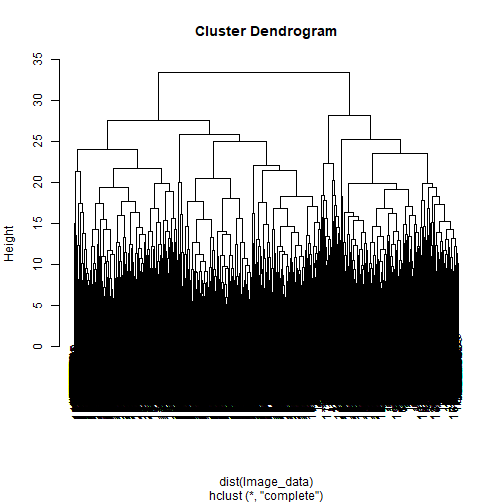
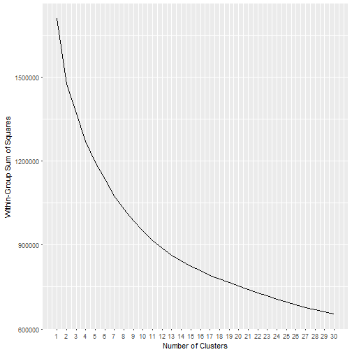

Basic Machine Learning Techniques in R
========================================================
author: Minh Pham (minhpham@usf.edu)
date: 6/19/2018
autosize: true

INTRODUCTION
========================================================
- Regular programming example:


```r
if (User@Use_R) User@Intelligence = "Smart" else User@Intelligence = "Unknown"
```
- Machine Learning example: 
 - $log{\frac{p}{1-p}} = \beta_{0} + \beta_{1}*UseR$

```r
# Given data, estimate beta0, beta1
# probability of being Smart:
p = 1/
  (1 + exp(beta0 + beta1 * User@Use_R))
```

Contents
========================================================
Common R packages and functions for:
- Supervise Learning
 - Classification
 - Regression
 - Time Series Data
 - Feature Selection & dimension reduction
- Unsupervise Learning
 - Clustering
 - Association Studies
- Reinforcement Learning


Supervise Learning - Classification 1
======================================================

**Example**: Letter recognition from images, [link to description](https://archive.ics.uci.edu/ml/machine-learning-databases/letter-recognition/letter-recognition.names)
- Black/white images $\rightarrow$ 16 numerical attributes
- Goal: predict letter from images
- get data:
<font size = "6">

```r
Letter_recognition = read.csv("https://archive.ics.uci.edu/ml/machine-learning-databases/letter-recognition/letter-recognition.data",
                              header = FALSE,
                              col.names = c("Letter", paste0("V", 1:16)))
head(Letter_recognition)
```

```
  Letter V1 V2 V3 V4 V5 V6 V7 V8 V9 V10 V11 V12 V13 V14 V15 V16
1      T  2  8  3  5  1  8 13  0  6   6  10   8   0   8   0   8
2      I  5 12  3  7  2 10  5  5  4  13   3   9   2   8   4  10
3      D  4 11  6  8  6 10  6  2  6  10   3   7   3   7   3   9
4      N  7 11  6  6  3  5  9  4  6   4   4  10   6  10   2   8
5      G  2  1  3  1  1  8  6  6  6   6   5   9   1   7   5  10
6      S  4 11  5  8  3  8  8  6  9   5   6   6   0   8   9   7
```
</font>

Supervise Learning - Classification 2
======================================
- Measure of performance: accuracy
- Importance of Cross-Validation:
  - Fair estimate of accuracy for future predictions
  - prevent over-fitting
  - package `` caret ``

Supervise Learning - Classification 3
======================================
- Pick algorithms:
Either use experience or just put everything into a neural network

<font size = "4">

```r
# library(devtools)
# install_github("minh2182000/Mtoolbox")
library(MToolBox)
```

```
[1] "LOADING MTOOLBOX"
```

```r
visual = Plot.VisualizeSupervise(Letter ~ . , data = Letter_recognition)
ggplotly(visual$Plot) -> Plot1
```
</font>

Supervise Learning - Classification 3 (cont)
======================================
<iframe src="Plot1.html" style="position:absolute;height:100%;width:100%"></iframe>

Supervise Learning - Classification 4
======================================

``caret::train()`` function:
  - ``method``: the name of machine learning method
  - ``trControl``: control cross-validation (and other things)
<font size = "5">

```r
library(caret, quietly = TRUE)
tail(names(getModelInfo()), 40) # list of ML methods wrapped by caret
```

```
 [1] "sda"                 "sdwd"                "simpls"             
 [4] "SLAVE"               "slda"                "smda"               
 [7] "snn"                 "sparseLDA"           "spikeslab"          
[10] "spls"                "stepLDA"             "stepQDA"            
[13] "superpc"             "svmBoundrangeString" "svmExpoString"      
[16] "svmLinear"           "svmLinear2"          "svmLinear3"         
[19] "svmLinearWeights"    "svmLinearWeights2"   "svmPoly"            
[22] "svmRadial"           "svmRadialCost"       "svmRadialSigma"     
[25] "svmRadialWeights"    "svmSpectrumString"   "tan"                
[28] "tanSearch"           "treebag"             "vbmpRadial"         
[31] "vglmAdjCat"          "vglmContRatio"       "vglmCumulative"     
[34] "widekernelpls"       "WM"                  "wsrf"               
[37] "xgbDART"             "xgbLinear"           "xgbTree"            
[40] "xyf"                
```

```r
length(names(getModelInfo())) 
```

```
[1] 237
```
</font>

Supervise Learning - Classification 5
======================================
 ``caret`` in action
<font size = "4">

```r
set.seed(9)
RandomForest = train(form = Letter ~ .,data = Letter_recognition,
                     method = "rf",
                     trControl = trainControl(method = "cv", number = 10))
set.seed(9)
# SVM = train(form = Letter ~ .,data = Letter_recognition,
                     # method = "svmPoly",
                     # trControl = trainControl(method = "cv", number = 10))
# accuracy 0.968
set.seed(9)
LDA = train(form = Letter ~ .,data = Letter_recognition,
                     method = "lda",
                     trControl = trainControl(method = "cv", number = 10))
set.seed(9)
KNN = train(form = Letter ~ .,data = Letter_recognition,
                     method = "knn",
                     trControl = trainControl(method = "cv", number = 10))
set.seed(9)
# NeuralNetworks = train(form = Letter ~ .,data = Letter_recognition,
                     # method = "mxnet",
                     # trControl = trainControl(method = "cv", number = 10))
# fail to converge

RandomForest$results[which.max(RandomForest$results$Accuracy),]
```

```
  mtry  Accuracy     Kappa  AccuracySD     KappaSD
1    2 0.9678498 0.9665623 0.003039887 0.003161565
```

```r
LDA$results[which.max(LDA$results$Accuracy),]
```

```
  parameter  Accuracy     Kappa AccuracySD    KappaSD
1      none 0.7015493 0.6896087 0.01114464 0.01158776
```

```r
KNN$results[which.max(KNN$results$Accuracy),]
```

```
  k  Accuracy     Kappa  AccuracySD     KappaSD
1 5 0.9536999 0.9518461 0.004063832 0.004226434
```
</font>

Supervise Learning - Classification 6
======================================
Notes on Neural Networks:
  - ``caret`` package:
    - ``method = "nnet"``: 1 hidden layer neural network
    - ``method = "neuralnet"``: multi-layer perceptron with the ability to create network graph
    - ``method = "mxnet"``: convolutional neural network
    - problem: sssslllooowwww
  - Tensorflow: API in R with package ``tensorflow``
  
Supervise Learning - Regression
======================================
Say we want to predict V1
<font size = "5">

```r
set.seed(9)
LM = train(form = V1 ~ .,data = Letter_recognition,
                     method = "lm",
                     trControl = trainControl(method = "cv", number = 10))
set.seed(9)
LASSO = train(form = V1 ~ .,data = Letter_recognition,
                     method = "lasso",
                     trControl = trainControl(method = "cv", number = 10))
LM$results[which.max(LM$results$RMSE),]
```

```
  intercept      RMSE  Rsquared       MAE     RMSESD  RsquaredSD
1      TRUE 0.7472773 0.8474434 0.5811092 0.01316444 0.004502595
        MAESD
1 0.009167998
```

```r
LASSO$results[which.max(LASSO$results$RMSE),]
```

```
  fraction     RMSE  Rsquared      MAE     RMSESD  RsquaredSD      MAESD
1      0.1 1.312787 0.7650078 0.991776 0.02397257 0.007318891 0.01154423
```

```r
# predict new data
predict(LM, newdata = Letter_recognition[1,])
```

```
       1 
2.109438 
```
</font>

Supervise Learning - Time Series
======================================
<font size = "4">

```r
data(economics)
head(economics, 3)
```

```
# A tibble: 3 x 6
  date         pce    pop psavert uempmed unemploy
  <date>     <dbl>  <int>   <dbl>   <dbl>    <int>
1 1967-07-01  507. 198712    12.5     4.5     2944
2 1967-08-01  510. 198911    12.5     4.7     2945
3 1967-09-01  516. 199113    11.7     4.6     2958
```

```r
timeSlices = createTimeSlices(economics$unemploy,
                              initialWindow = 100, # number of train
                              horizon = 10, # number of test
                              skip = 75) # to reduce number of slices
library(forecast, quietly = TRUE); library(dplyr, quietly = TRUE)
MSPE = numeric(0)
for (i in 1:length(timeSlices$train) ){ # for each time slice
  ARIMA = auto.arima(ts(economics$unemploy[timeSlices$train[[i]]]), # train
                     xreg = as.matrix(
                       economics 
                        %>% select(pce, pop, psavert)
                        %>% slice(timeSlices$train[[i]])
                     )
                     )
  pred = predict(ARIMA, n.ahead = 10, # test
                 newxreg = as.matrix(
                   economics 
                   %>% select(pce, pop, psavert)
                   %>% slice(timeSlices$test[[i]])
                 ))
  MSPE[i] = mean((pred$pred - economics$unemploy[timeSlices$test[[i]]])^2)
}
mean(sqrt(MSPE))
```

```
[1] 812.2752
```
</font>

Supervise Learning - Feature selection
=========================================================
select the original variables
<font size = "5">

```r
LDA_RFE = rfe(x = model.matrix(Letter ~ . - 1, data = Letter_recognition),
              y = Letter_recognition$Letter,
              sizes = c(7, 13),
              rfeControl = rfeControl(functions = caretFuncs, # select method in caret
                                      number = 3, # number of resampling
                                      ),
              method = "lda")
LDA_RFE$optVariables
```

```
 [1] "V9"  "V7"  "V15" "V11" "V14" "V12" "V8"  "V16" "V6"  "V13" "V5" 
[12] "V1"  "V10" "V3"  "V4"  "V2" 
```
</font>


Supervise Learning - dimension reduction
=========================================================
transform original variables then select

<font size = "4">

```r
PCA = prcomp(model.matrix(Letter ~ . - 1, data = Letter_recognition))
cat("variance explained according to number of PCs selected \n"); cumsum(PCA$sdev)/sum(PCA$sdev)
```

```
variance explained according to number of PCs selected 
```

```
 [1] 0.1537318 0.2651716 0.3666967 0.4516226 0.5307728 0.5987914 0.6634730
 [8] 0.7203692 0.7713238 0.8154847 0.8535161 0.8899036 0.9249652 0.9569267
[15] 0.9826641 1.0000000
```

```r
NewPredictors = PCA$x[,1:15]
cat("selected PCs \n"); head(NewPredictors, 5)
```

```
selected PCs 
```

```
        PC1         PC2       PC3         PC4        PC5        PC6
1 -3.818090 -5.57463125 -2.219385  0.09472971  0.7583919  1.7756016
2  2.958174  3.46922565 -3.585113 -2.41158532  5.0043660 -1.7477970
3  4.885103  2.83614991 -3.869483 -3.14087513  1.2221533 -0.3319215
4  3.895993 -0.09778645  1.848129  0.81221661  0.9815300  2.5837991
5 -7.819106  4.75456343  0.419007  1.93790098 -1.8807016  0.1069132
         PC7        PC8        PC9       PC10       PC11       PC12
1  2.7107564 -5.0558330  2.5029405  1.5456361 -1.1259496  3.4653079
2 -3.2809981 -2.6277545 -0.9624055 -0.1720035  1.8472975  0.3134327
3  0.4955531 -1.5343063  1.2772994  0.6433774 -1.6201972  0.3534329
4  4.2607025 -0.2211921 -1.0811792  3.5281871  1.4428505  1.5415739
5 -1.2163781  0.1642898  0.3731866  1.2866211  0.6143772 -0.1860740
        PC13       PC14       PC15
1  0.3570514  0.7725934 -0.5497023
2 -1.1596903 -1.1971807  0.7683747
3  0.5466133 -1.4763790 -0.4429723
4 -3.4667407 -0.1771255  0.6012779
5  0.3172326  1.4285464 -0.5962135
```
</font>

UnSupervise Learning - Clustering 1
=========================================================
<font size = "5">
When we have no target variable

```r
Image_data = Letter_recognition %>% select(-Letter)
```

- Hierachical clustering: good for non-spherical clusters, sensitive to noise, slow, can help decide the number of clusters

```r
HC = hclust(dist(Image_data))
plot(HC)
```


</font>

UnSupervise Learning - Clustering 2
=========================================================
<font size = "4">
- K-Means: spherical clusters, fast, results are random, have to specify number of cluster

```r
KMEAN = kmeans(Image_data, centers = 26)
KMEAN_result = cbind(cluster = as.factor(KMEAN$cluster), Image_data)
library(MToolBox)
Plot2 <- Plot.VisualizeSupervise(cluster ~ ., data = KMEAN_result)$Plot
```

<iframe src="Plot2.html" style="position:absolute;height:100%;width:100%"></iframe>

</font>

UnSupervise Learning - Clustering 3
=========================================================
How many clusters? We can try to guess by using hierachical
<font size = "5">

```r
library(MToolBox)
Plot.ClusterElbow(Image_data, 30)
```


</font>

UnSupervise Learning - Clustering 4
=========================================================
<font size = "5">
Cut the tree for Hierachical

```r
clusters = cutree(HC, k = 20) # this is a vector of cluster numbers
```
</font>

<font size = "5">
K-Means:

```r
KMEAN = kmeans(Image_data, centers = 20)
clusters = KMEAN$cluster # this is a vector of cluster numbers
```
</font>

Association Studies
=========================================================
- Market Basket
- Genome-wide Association Study
- Drug-Adverse event Association Study

Association Studies 1
=========================================================

Example: Association Rules algorithm
<font size = "4">

```r
library(arules)
groceries = read.csv("http://www.sci.csueastbay.edu/~esuess/classes/Statistics_6620/Presentations/ml13/groceries.csv", header = FALSE)
head(groceries,5)
```

```
                V1                  V2             V3
1     citrus fruit semi-finished bread      margarine
2   tropical fruit              yogurt         coffee
3       whole milk                                   
4        pip fruit              yogurt   cream cheese
5 other vegetables          whole milk condensed milk
                        V4
1              ready soups
2                         
3                         
4             meat spreads
5 long life bakery product
```

```r
transactions = read.transactions("http://www.sci.csueastbay.edu/~esuess/classes/Statistics_6620/Presentations/ml13/groceries.csv", sep = ",")
summary(transactions)
```

```
transactions as itemMatrix in sparse format with
 9835 rows (elements/itemsets/transactions) and
 169 columns (items) and a density of 0.02609146 

most frequent items:
      whole milk other vegetables       rolls/buns             soda 
            2513             1903             1809             1715 
          yogurt          (Other) 
            1372            34055 

element (itemset/transaction) length distribution:
sizes
   1    2    3    4    5    6    7    8    9   10   11   12   13   14   15 
2159 1643 1299 1005  855  645  545  438  350  246  182  117   78   77   55 
  16   17   18   19   20   21   22   23   24   26   27   28   29   32 
  46   29   14   14    9   11    4    6    1    1    1    1    3    1 

   Min. 1st Qu.  Median    Mean 3rd Qu.    Max. 
  1.000   2.000   3.000   4.409   6.000  32.000 

includes extended item information - examples:
            labels
1 abrasive cleaner
2 artif. sweetener
3   baby cosmetics
```
</font>

Association Studies 2
=========================================================
<font size = "6">

```r
rules = apriori(transactions, parameter = list(support = 0.001 # parameter for sensitivity
                                       ),
                control = list(verbose = FALSE))

rules_df = as(rules, "data.frame")
head(rules_df$rules[
  order(rules_df$lift, decreasing = TRUE)]
  , 10) # print associated items
```

```
 [1] {liquor,red/blush wine} => {bottled beer}                                      
 [2] {citrus fruit,fruit/vegetable juice,other vegetables,soda} => {root vegetables}
 [3] {oil,other vegetables,tropical fruit,whole milk,yogurt} => {root vegetables}   
 [4] {citrus fruit,fruit/vegetable juice,grapes} => {tropical fruit}                
 [5] {other vegetables,rice,whole milk,yogurt} => {root vegetables}                 
 [6] {oil,other vegetables,tropical fruit,whole milk} => {root vegetables}          
 [7] {ham,other vegetables,pip fruit,yogurt} => {tropical fruit}                    
 [8] {beef,citrus fruit,other vegetables,tropical fruit} => {root vegetables}       
 [9] {butter,cream cheese,root vegetables} => {yogurt}                              
[10] {butter,sliced cheese,tropical fruit,whole milk} => {yogurt}                   
410 Levels: {baking powder,tropical fruit,yogurt} => {whole milk} ...
```
</font>

Wrap Up
=========================================================
- Supervised Learning: ``caret`` has all you need
  - Will benefit a lot from hyperthreading
  - probably more state-of-the-art algorithms from ``tensorflow`` and ``h2o``
- Unsupervised learning:
  - clustering is in ``base``
  - Association Study hugely depends on the problem
- Still missing: reinforcement learning
  
