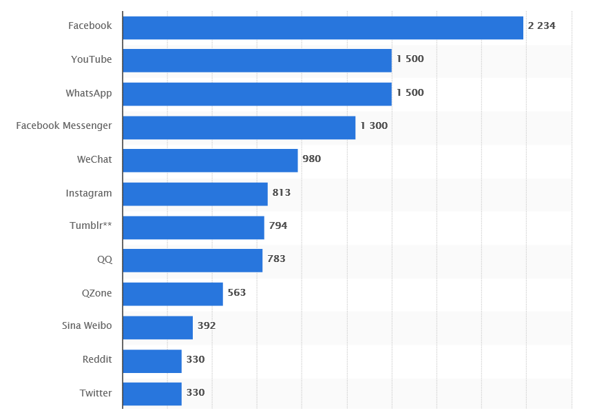
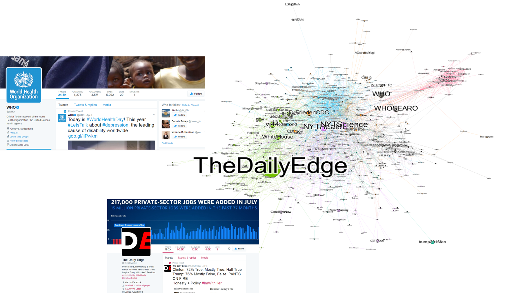

```{r setup, include=FALSE}
options(htmltools.dir.version = FALSE)
```

```{r xaringan-themer, include=FALSE}
library(xaringanthemer)
solarized_dark(
  code_font_family = "Fira Code",
  code_font_url    = "https://cdn.rawgit.com/tonsky/FiraCode/1.204/distr/fira_code.css",
  text_font_size = "30px"
)
```

# The plan

- why use twitter vs other social platforms?
- what do we mean by a network, and key jargon phrases
- the meat, using rtweet to identify social relationships in twitter

---

# Size of social networks, Twitter is not the biggest
````{r,out.width="500px",echo=FALSE}

```
---
class: inverse, center, middle

# Yet, compared FB/Instagram (others?) Twitter is more open about data collection

- Facebook has been slowly (and more rapidly with recent scandles) shutting down API endpoints
- Also, by design few networks are default "open" like Twitter

---

# An example twitter analysis (identifying important accounts during 2016-2017 Zika outbreak)

````{r,out.width="500px",echo=FALSE}

```

---
# One slide of Jargon, I swear
.pull-left[
```{r, random directed graph,echo=FALSE,out.width='400px'}
dg<-igraph::sample_gnp(10,.2,directed=TRUE)
plot(dg)
```
]
.pull-right[
```{r, random graph,echo=FALSE,out.width='400px'}
g<-igraph::sample_gnp(10,.2)
plot(g)
```
]
- nodes/vertices basic unit in a network
- edges form the relationships between nodes/vertices
- a network can be undirected, or directed (twitter networks are directed)
---

# all things rtweet and networky
- the current state of the art is rtweet, don't use tweetR (run away from guides that suggest it)
- rtweet authentification - use the create_token with all 4 keys from your twitter app specified for least restistance
- kateto.net/network-visualization (great intro to network munging/plotting with igraph, some interactive)
- rud.is/books/21-recipes (recipes for mining twitter data, based on rtweet)
---

# Rules of the road - knowing the twitter limits
- DON'T SHARE FULL CSVs OF TWITTER DATA. Tweet ids are OK (you see this on githubs all the time)
- If you have enough forknowledge/planned ahead, use the streaming API to collect large amounts of data
- search_tweets quickly runs into a wall of about 18k tweets per 15 minutes
- its only real benefit is that you can actually do some limited retrospective analysis (6-9 days)
- some things are REALLY slow, like getting the full follower list for a popular account (plan ahead)

---
# Demo Time

---
